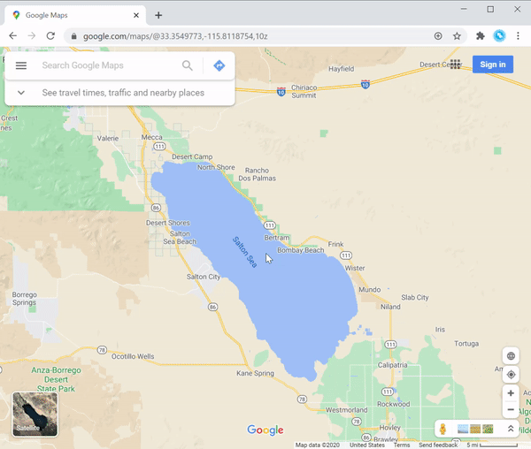

= Chrome Mapping Extension

image::https://img.shields.io/chrome-web-store/v/maeojijfkkhoinnffgfobihlgfcllfoj.svg[link=https://chrome.google.com/webstore/detail/mapping-extensions/maeojijfkkhoinnffgfobihlgfcllfoj]

This Chrome extension adds context menu shortcuts to open various location-based sites from Google Maps and CalTopo.

== Features

=== For Google Maps

* Open in CalTopo
* Open in Mountain Project
* NOAA forecast
* Strava Heatmap

=== For CalTopo

* Open in Google Maps
* Open in Mountain Project
* Strava Heatmap

== Install

Install via the https://chrome.google.com/webstore/detail/mapping-extensions/maeojijfkkhoinnffgfobihlgfcllfoj[Mapping Extensions] page on the Chrome Web Store.

== Demos

=== NOAA Forecast

=== Open in Mountain Project

image::demo-mountain-project.gif[]
